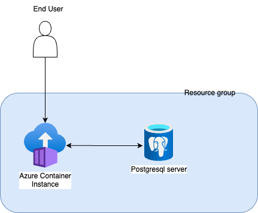

# serviantechchallenge
This repository contains one of the many possible solutions for the techchallenge by Servian

## Deploying this Solution

To implement this solution deploy the workflow `deploy-techchallengeapp`. This workflow executes terraform config to deploy resource group, postgresql server and database and a container instance to run the docker container. The container instance overwrites dbhost and dbpassword.
 
Current implementation:  

## Possible production implementation

One of the way to make this a production equivalent is to introduce virtual network integration and using application gateway for ingress. Below diagram is a high level implementation:
 
Production implementation:  
